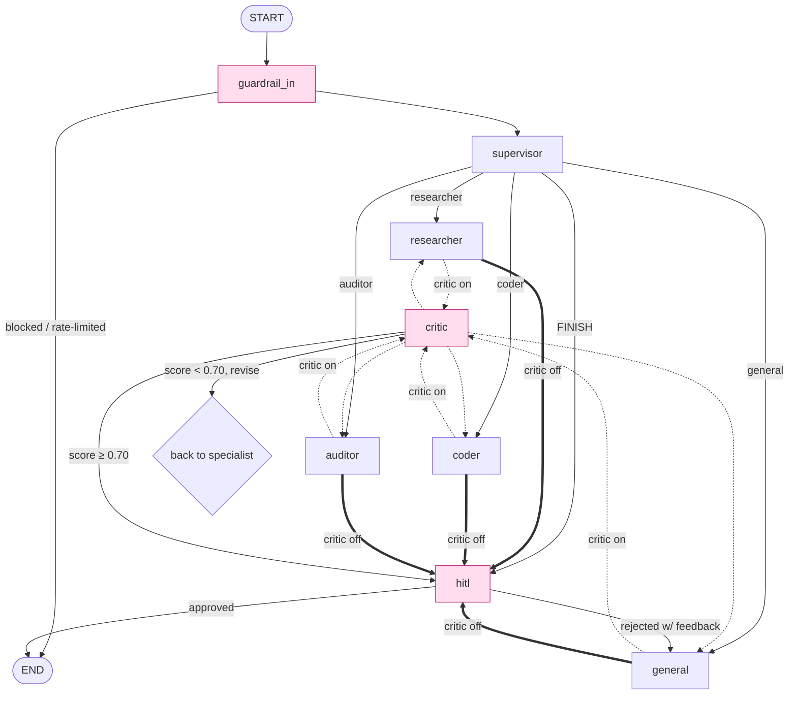

# AI Auditor — Document Compliance for AI-Readiness

Audit your document repositories *before* feeding them into a RAG pipeline. Every file is scored on staleness, standards compliance, and governance metadata — no LLM calls, no quotas, no waiting. A multi-agent chat then helps you understand and fix what the audit found.

Built on **LangGraph**, with a **provider-agnostic** LLM layer: run it fully local on **Ollama** (no API key), or point it at **Anthropic, Groq, OpenAI, or any other provider** by changing one line in a config file.

---

## What it does

| Signal | What it catches |
|---|---|
| **Staleness** | Files past their review cadence, cold-access documents, overdue dates in body text |
| **Standards** | Missing required sections, non-standard formats, retired standard references (ISO 27001:2013, "proposed AI Act", …) |
| **Governance** | No named owner, missing classification, absent retention or review date |

Each document gets a **trust score 0 → 1**. Anything below **0.70** is flagged before it can mislead your RAG system.

The multi-agent chat then lets you ask questions, get remediation advice, and run web research — with provider-agnostic LLMs, retry-hardened calls, agentic retrieval, Reflexion self-critique, and optional human-in-the-loop approval.

| Capability | Status |
|---|---|
| Document audit engine (pure Python, ~42 docs/sec) | ✅ |
| Provider-agnostic LLMs (any LangChain provider via `.env`) | ✅ |
| Fully-local, no-API-key path (Ollama) | ✅ |
| Supervisor → specialist routing (researcher / coder / general / auditor) | ✅ |
| Reflexion critic (opt-in) with small-model-safe fallback | ✅ |
| Retry + backoff around every LLM call | ✅ |
| Context compaction for long/resumed threads | ✅ |
| Agentic RAG (relevance grading, query rewrite, structured citations) | ✅ |
| Episodic memory (Mem0) | ✅ |
| Human-in-the-loop approval gate | ✅ |
| RBAC + sliding-window rate limiting | ✅ |
| Encoding-aware prompt-injection detection + PII redaction | ✅ |
| MCP tools (stdio + HTTP/SSE), per-server isolation | ✅ |
| Evals: routing, end-to-end, **trajectory/tool-call**, RAGAS | ✅ |

---

# Architecture

> This section is the deep technical reference. If you just want to **run** the app, skip to [Installation](#installation).

## Two systems, one app

```
┌─────────────────────────┐        ┌────────────────────────────────────┐
│  Audit engine (domain/)  │        │  Multi-agent system (graph/, agents/)│
│  pure Python, 0 LLM calls │  ───▶  │  LangGraph supervisor + specialists  │
│  staleness/standards/gov  │        │  chat, research, remediation         │
└─────────────────────────┘        └────────────────────────────────────┘
```

The **audit engine** is deterministic and offline — it never calls an LLM, so it is fast, free, and reproducible. The **multi-agent system** sits on top for natural-language interaction and uses LLMs.

## Graph topology



<details>
<summary>ASCII fallback (if Mermaid doesn't render)</summary>

```
START → guardrail_in ──(blocked)──────────────► END
              │
              ▼
          supervisor ──► researcher / coder / general / auditor
              ▲                        │
              │                        ▼
              │                  critic (Reflexion, opt-in)
              │                  ↙            ↘
        (revise: score<0.70)            (pass: score≥0.70)
                                              │
                                              ▼
                                            hitl ──(approved)──► END
                                              │
                                       (rejected w/ feedback)
                                              ▼
                                           general
```
(When the critic is **disabled** — the default — specialists go straight to `hitl`.)
</details>

### Node & edge semantics

| Node | Type | Responsibility |
|---|---|---|
| `guardrail_in` | function | Resolves role/identity, enforces the **rate limit**, runs **prompt-injection detection** (incl. base64/escape/zero-width decoding) and **PII redaction**. On block/limit it short-circuits to `END`. |
| `supervisor` | structured-output router | Reads the conversation and emits `SupervisorDecision{next, reasoning}` (Pydantic). Hard-stops at `MAX_SUPERVISOR_ROUNDS`. Downgrades the chosen agent if the caller's **role** forbids it. |
| `researcher` / `coder` / `general` / `auditor` | `langchain.agents.create_agent` | ReAct specialists with fixed tool sets + memory tools. Input history is **compacted** first; the LLM call is **retry-wrapped**. (Migrated off the deprecated `langgraph.prebuilt.create_react_agent`.) |
| `critic` | structured-output scorer | Reflexion: scores the last answer `0–1`; routes back for revision if `< 0.70` (capped at 2 revisions). Off by default. |
| `hitl` | `interrupt()` gate | Optional. Pauses the graph to disk via the checkpointer; the UI shows the answer for approval and resumes with the human's decision. |

Edges from `supervisor` and `critic` are **conditional** (keyed on `next_agent` / `should_revise`). Whether specialists pass through `critic` is decided **at build time** by `CRITIC_ENABLED`.

### State schema (`graph/state.py`)

A single `AgentState` TypedDict flows through every node. `messages` uses LangGraph's `add_messages` reducer (auto-merge across turns). Key fields:

- **Routing:** `next_agent`, `reasoning`, `last_specialist`, `supervisor_rounds`
- **Reflexion:** `critique`, `critique_score`, `should_revise`, `revision_count`
- **HITL:** `hitl_required`
- **Identity/permissions:** `role`, `identity`

### Why these patterns

- **Supervisor, not swarm.** A central router gives one auditable decision point, deterministic role-based permission enforcement, and a hard round cap — easier to reason about and secure than peer-to-peer handoff for this workload. (Parallel fan-out and a plan-and-execute planner are on the [roadmap](#roadmap); they were deliberately deferred to avoid destabilizing the topology, HITL, and checkpointing.)
- **Reflexion critic (opt-in).** Verbal self-critique (Shinn et al., 2023) catches incomplete/ungrounded answers. It costs one extra LLM call per turn, so it's **off by default** and gated behind `CRITIC_ENABLED`. The critic is hardened for small/local models: if structured output fails it retries, then scrapes a score from free text, and only as a last resort passes through **at threshold** — never the misleading "perfect score" that would silently hide a failure.
- **HITL via `interrupt()`.** Real human approval needs durable pause/resume, not a blocking prompt. LangGraph's `interrupt()` serializes the graph to the SQLite checkpoint; the UI resumes it later by `thread_id`.

## Provider abstraction (`agents/llm.py`)

Every model is built through LangChain's `init_chat_model`, so **any** supported provider works by editing `.env` — no code changes, and no provider SDK is imported anywhere outside this one factory.

```
get_llm(role=…)                        # @lru_cache
  ├─ provider  = ROLE_PROVIDER_<ROLE>  or  LLM_PROVIDER
  ├─ model     = ROLE_MODEL_<ROLE>     or  provider default  or  LLM_MODEL
  ├─ max_tokens= ROLE_MAX_TOKENS_<ROLE> or per-role cap      (num_predict for Ollama)
  └─ init_chat_model(model, model_provider=provider, …)
```

- **First-class (shipped + tested):** `anthropic`, `groq`, `ollama` (fully local, no key), `openai` (incl. any OpenAI-compatible endpoint via `OPENAI_BASE_URL` — vLLM, LM Studio, OpenRouter).
- **Everything else** (`mistralai`, `google_genai`, `bedrock`, `cohere`, …): install that provider's `langchain-<provider>` extra, set its standard API-key env var, pick a model with `LLM_MODEL`. Done.
- **Per-role routing:** any role can run on a different provider/model — e.g. the critic on free Groq while everything else is on Claude.
- **Token caps:** sensible per-role output caps (supervisor 512, critic 512, specialists 2000, …) prevent runaway cost; override per role.

Embeddings (RAG + Mem0) always run **locally** and ignore `LLM_PROVIDER`.

## Resilience & long-thread safety

- **Retries (`agents/resilience.py`).** Every LLM `.invoke` — supervisor, critic, executor, and the specialist ReAct turns — is wrapped in bounded exponential-backoff retries (tenacity). Transient rate-limits, timeouts, and the "model is loading" stalls common with local Ollama no longer abort a turn. Tunable via `LLM_MAX_RETRIES` / `LLM_RETRY_MAX_WAIT`.
- **Context compaction (`graph/compaction.py`).** Threads resume by `thread_id`, so history grows unbounded and would eventually overflow the context window. Before each specialist/critic call, history is trimmed to a bounded recent window using `trim_messages(start_on="human")` — which never orphans a tool-call/tool-result pair — and an elision note is prepended. Optionally (`CONTEXT_SUMMARIZE=true`) the dropped span is condensed in one cheap LLM call.

## Memory tiers

| Tier | Backend | Used for |
|---|---|---|
| **Semantic / RAG** (`memory/vector_store.py`) | ChromaDB + `bge-small-en-v1.5` (local CPU, no service) | Uploaded documents & notes. **Agentic retrieval pipeline:** fetch candidates → **cross-encoder rerank** (`bge-reranker-base`, lazy, graceful fallback) → **LLM relevance grade** (CRAG-style, off-topic chunks dropped) → on an "insufficient" verdict **rewrite the query and retry once** → **structured citations** (source file + chunk offset + score). Degrades to plain top-k on any failure. Toggle with `RAG_RERANK` / `RAG_GRADE` / `RAG_QUERY_REWRITE`. |
| **Episodic** (`memory/episodic.py`) | Mem0 + local Ollama embeddings | Cross-session facts. `remember` / `recall` are tools injected into every agent. |

## Guardrails & permissions

- **Input:** length cap, **prompt-injection detection** (keyword patterns, plus decoding of base64 / `\xNN`-`\uNNNN` escapes / zero-width & bidi obfuscation before matching), PII redaction (email, phone, card, SSN, IBAN).
- **Output:** PII leakage check, refusal-pattern flag, hallucination-risk flag (confident answer with no tool grounding).
- **RBAC (`guardrails/permissions.py`):** roles `viewer` / `analyst` / `admin` gate which agents and tools a session may use, with per-role **sliding-window rate limits**.

## Tool-result caching

Idempotent, network-bound tools (`web_search`) are wrapped in a small TTL+LRU cache (`tools/cache.py`). The critic revision loop in particular re-issues identical searches; caching cuts latency and external calls. Only successes are cached — failures stay uncached and retry. Tunable via `TOOL_CACHE_TTL` (`0` disables).

## Eval methodology (`eval/`)

| Eval | What it measures | How |
|---|---|---|
| **Routing** | Does the supervisor pick the right specialist? | Compares `SupervisorDecision.next` to expected, per case. |
| **End-to-end** | Is the final answer right? | Keyword presence/absence over the full-graph response. |
| **Trajectory / tool-call** | Did the agent follow the right *process*? | Streams the graph with `subgraphs=True` to capture the node sequence **and the tools actually called**, then scores tool-call correctness with **`agentevals`** (subset trajectory-match) — catching agents that guess correctly without using the required tool. |
| **RAGAS** (`rag_eval.py`) | Retrieval quality | Faithfulness, answer relevancy, context recall/precision. |

Persistence: a SQLite checkpointer at `data/chroma_db/checkpoints.sqlite` — conversations resume by `thread_id`. Observability: Langfuse callbacks when `LANGFUSE_PUBLIC_KEY` is set, else a local console tracer.

---

# Installation

**This section assumes you have never opened a terminal before.** A "terminal" is a window where you type commands instead of clicking. On Mac it's called **Terminal**; on Windows, **PowerShell**. Open it, then follow along — each block is something you copy, paste, and press Enter on.

> 💡 Throughout: lines starting with `#` are notes for you — you don't type those.

### Step 0 — Install the prerequisites (one time)

You need two free programs: **Python 3.11** (the language this app is written in) and **Git** (downloads the code).

- **Python 3.11:** download from [python.org/downloads](https://www.python.org/downloads/release/python-3119/). On Windows, **tick "Add Python to PATH"** in the installer.
  > ⚠️ It must be **3.11**. Versions 3.12 and newer break two of the memory libraries (Mem0, ChromaDB).
- **Git:** download from [git-scm.com/downloads](https://git-scm.com/downloads). Accept the defaults.

**Check they worked.** Paste this and press Enter:

```bash
python3.11 --version   # should print: Python 3.11.x
git --version          # should print: git version 2.x
```
✅ **Success looks like:** two version numbers. ❌ If you see "command not found", the program isn't installed or wasn't added to PATH — re-run its installer.

### Step 1 — Download the app

```bash
# Copies the code to your computer and moves you into its folder
git clone https://github.com/MarcLVR/SOTA_AAI.git
cd SOTA_AAI
```
✅ **Success looks like:** a few lines ending in "done", and your prompt now shows `SOTA_AAI`.

### Step 2 — Create a private workspace for the app

This keeps the app's libraries separate from the rest of your computer (a "virtual environment").

```bash
# Creates the workspace folder ".venv"
python3.11 -m venv .venv

# Switches into it. You'll see "(.venv)" appear at the start of your prompt.
source .venv/bin/activate           # Mac / Linux
# .venv\Scripts\activate            # Windows PowerShell — use THIS line instead on Windows
```
✅ **Success looks like:** your prompt now starts with `(.venv)`. You must re-run the `activate` line every time you open a new terminal.

### Step 3 — Install the app's libraries

```bash
# Downloads everything the app needs. Takes a few minutes the first time.
pip install -r requirements.txt
```
✅ **Success looks like:** lots of scrolling, ending with "Successfully installed …". A few yellow warnings are normal.

### Step 4 — Create your settings file

```bash
# Copies the example settings into your own editable settings file
cp .env.example .env
```

Now open the new `.env` file in any text editor (TextEdit, Notepad). You have **two choices**:

**Choice A — Fully free & private, runs on your own machine (recommended to start).**
No account, no API key, no internet needed for the AI. You first install **Ollama** (a free app that runs AI models locally) from [ollama.com](https://ollama.com), then in a terminal:
```bash
ollama pull llama3.2     # downloads the local AI model (~2 GB, one time)
```
Then in `.env`, find and set these lines:
```env
LLM_PROVIDER=ollama
OLLAMA_MODEL=llama3.2
```

**Choice B — Use Anthropic's Claude (smarter, needs a paid API key).**
Get a key at [console.anthropic.com](https://console.anthropic.com). In `.env`:
```env
LLM_PROVIDER=anthropic
ANTHROPIC_API_KEY=sk-ant-...your-key-here...
```

Save and close the file.

### Step 5 — Create sample documents to audit (optional but recommended)

```bash
# Generates 42 fake documents so you have something to audit immediately
python -m domain.demo_corpus.generate_sample
```
✅ **Success looks like:** a message that sample files were created.

### Step 6 — Start the app

```bash
python main.py
```
✅ **Success looks like:** a line saying the app is running at **http://localhost:7860**. Open that address in your web browser.

> 🖼️ _[Screenshot placeholder: the dashboard with the audit table on Tab 1]_
> 🖼️ _[Screenshot placeholder: the multi-agent chat on Tab 3]_

To stop the app, click back in the terminal and press **Ctrl + C**.

### Other ways to run it

```bash
python main.py --cli              # chat in the terminal instead of the browser
python main.py --query "..."      # ask one question, print the answer, exit
```

### Troubleshooting (symptom → fix)

| What you see | What it means | Fix |
|---|---|---|
| `command not found: python3.11` | Python 3.11 isn't installed / not on PATH | Re-run the python.org installer; on Windows tick "Add Python to PATH" |
| `command not found: source` (Windows) | You used the Mac line | Use `.venv\Scripts\activate` instead |
| Prompt doesn't show `(.venv)` | The workspace isn't active | Re-run the Step 2 `activate` line |
| `ANTHROPIC_API_KEY is not set` | You chose Claude but didn't add the key | Open `.env`, paste your key after `ANTHROPIC_API_KEY=` |
| `Connection refused` / Ollama errors | The local AI app isn't running | Install & open **Ollama**, then `ollama pull llama3.2` |
| App is very slow on the local model | `llama3.2` is small but CPU-bound | Use a smaller prompt, or switch to Choice B (Claude) |
| `Port 7860 is in use` | The app is already running elsewhere | Close the other one, or `GRADIO_SERVER_PORT=7861 python main.py` |
| `ModuleNotFoundError` | Step 3 didn't finish | Re-run `pip install -r requirements.txt` with `(.venv)` active |
| Python 3.12+ errors about Mem0/Chroma | Wrong Python version | Recreate the workspace with `python3.11` (Step 2) |

---

## Configuration

All variables are read from `.env` (or the shell environment).

### LLM provider

| Variable | Default | Notes |
|---|---|---|
| `LLM_PROVIDER` | `anthropic` | `anthropic` · `groq` · `ollama` · `openai` · `mistralai` · `google_genai` · `bedrock` · … (any LangChain provider) |
| `LLM_MODEL` | — | Generic model name for providers without a dedicated field below |
| `ANTHROPIC_API_KEY` / `ANTHROPIC_MODEL` | — / `claude-haiku-4-5-20251001` | |
| `GROQ_API_KEY` / `GROQ_MODEL` | — / `llama-3.3-70b-versatile` | Free keys at console.groq.com |
| `OLLAMA_BASE_URL` / `OLLAMA_MODEL` | `http://localhost:11434` / `llama3.2` | Fully local, no key |
| `OPENAI_API_KEY` / `OPENAI_MODEL` / `OPENAI_BASE_URL` | — / `gpt-4o-mini` / — | `OPENAI_BASE_URL` targets any OpenAI-compatible endpoint |

**Per-role overrides** — pin any role to a different provider/model/token cap:

```env
ROLE_PROVIDER_CRITIC=groq
ROLE_MODEL_EXECUTOR=claude-sonnet-4-6
ROLE_MAX_TOKENS_AUDITOR=2000
```
Valid roles: `supervisor` `researcher` `coder` `general` `auditor` `critic` `executor` `semantic`

### Agent behaviour, resilience & context

| Variable | Default | Notes |
|---|---|---|
| `MAX_SUPERVISOR_ROUNDS` | `5` | Hard cap on routing loops |
| `CRITIC_ENABLED` | `false` | Reflexion loop; off saves one LLM call per answer |
| `CRITIC_REVISION_THRESHOLD` | `0.70` | Score below this triggers a revision |
| `CRITIC_MAX_REVISIONS` | `2` | Max revision rounds per turn |
| `LLM_MAX_RETRIES` | `2` | Extra retries on transient LLM errors (total = 1 + this) |
| `LLM_RETRY_MAX_WAIT` | `8.0` | Cap on backoff between retries (seconds) |
| `CONTEXT_MAX_MESSAGES` | `24` | Compact a thread once its history exceeds this |
| `CONTEXT_KEEP_LAST` | `10` | Most-recent messages always kept verbatim |
| `CONTEXT_SUMMARIZE` | `false` | `true` → summarise dropped messages with one LLM call |

### Retrieval & tools

| Variable | Default | Notes |
|---|---|---|
| `RAG_RERANK` | `true` | Second-stage cross-encoder reranking |
| `RAG_RERANK_MODEL` | `BAAI/bge-reranker-base` | CPU-friendly; override to `BAAI/bge-reranker-v2-m3` for max quality |
| `RAG_GRADE` | `true` | CRAG-style LLM relevance grading of retrieved chunks |
| `RAG_QUERY_REWRITE` | `true` | Rewrite query + re-retrieve once when grading says "insufficient" |
| `EMBEDDING_MODEL` | `BAAI/bge-small-en-v1.5` | Local CPU embeddings (no service dependency) |
| `TOP_K_RETRIEVAL` | `5` | Chunks returned per query |
| `TOOL_CACHE_TTL` | `300` | Seconds to cache idempotent tool results (`web_search`); `0` disables |

### Application identity

| Variable | Default | Notes |
|---|---|---|
| `APP_NAME` | `AI Auditor` | Shown in UI and bot messages |
| `BRAND_NAME` | _(empty)_ | Canonical brand to enforce; empty disables brand checking |
| `DEFAULT_OWNER` / `OWNER_USERNAMES` | _(empty)_ | Owner resolution / routing |

### Permissions

| Role | Agents | Audit | Upload | Code | Rate limit |
|---|---|---|---|---|---|
| `viewer` | general | ❌ | ❌ | ❌ | 10 req/60 s |
| `analyst` | general, researcher, auditor | ✅ | ✅ | ❌ | 30 req/60 s |
| `admin` | all | ✅ | ✅ | ✅ | 120 req/60 s |

| Variable | Default | Notes |
|---|---|---|
| `ACTIVE_ROLE` | `admin` | Role applied to all UI sessions |
| `PERMISSION_KEYS` | `{}` | JSON dict mapping API key → role, e.g. `{"sk-abc":"analyst"}` |

### MCP servers

The local filesystem server is active by default (needs Node/`npx` available). Remote HTTP servers are added via `MCP_HTTP_SERVERS`:

```env
MCP_HTTP_SERVERS=[{"name":"my-server","transport":"streamable_http","url":"https://example.com/mcp","headers":{"Authorization":"Bearer sk-..."}}]
```
Supported transports: `stdio` · `sse` · `streamable_http`. Each server loads in isolation — one failing server is skipped, not fatal. MCP elicitation requests (mid-tool-call form/URL flows) are routed to a UI panel.

### Integrations (all optional)

| Variable | Notes |
|---|---|
| `LANGFUSE_PUBLIC_KEY` | Activates Langfuse cloud tracing |
| `SEMANTIC_ENABLED` | `false` — per-document standards comparison button |
| `DB_ENABLED` | `false` — Analytics tab + Postgres writes |
| `TELEGRAM_BOT_TOKEN` / `TELEGRAM_OWNERS` | Telegram notification pipeline |

---

## CLI reference

```bash
# Audit any folder
python -m domain.run_audit /path/to/docs
python -m domain.run_audit /path/to/docs --json    # machine-readable output
python -m domain.run_audit /path/to/docs --top 20  # worst 20 documents

# Inspect a single document
python -m domain.inspect_doc path/to/file.docx
python -m domain.inspect_doc path/to/file.pdf --json | jq '.findings'

# Evals
python -m eval.agent_eval                # routing + e2e + trajectory
python -m eval.agent_eval --routing      # routing only
python -m eval.agent_eval --trajectory   # trajectory + tool-call only
python -m eval.rag_eval                  # RAGAS metrics
```

---

## Project structure

```
├── main.py                   # entry point (UI / CLI / single query)
├── config/settings.py        # all env vars → pydantic Settings
├── agents/                   # LLM factory (init_chat_model), resilience wrapper,
│   │                         #   supervisor, specialists, critic, executor
│   ├── llm.py                # provider-agnostic factory
│   └── resilience.py         # retry/backoff around every LLM .invoke
├── graph/                    # LangGraph state machine
│   ├── state.py              # AgentState TypedDict
│   ├── workflow.py           # nodes, edges, checkpointer
│   └── compaction.py         # long-thread context compaction
├── domain/                   # audit engine — zero LLM calls
│   ├── knowledge.py          # thresholds, retired standards, required sections
│   ├── run_audit.py          # programmatic API + CLI
│   ├── tools/                # crawler, extractor, staleness, standards, governance
│   └── demo_corpus/          # 42-file synthetic corpus generator
├── standards/                # governance docs (RAG + semantic layer)
├── memory/                   # vector_store.py (agentic RAG) + episodic.py (Mem0)
├── guardrails/               # injection/PII guards, RBAC permissions, MCP elicitation
├── tools/                    # web_search, python_repl, file tools, audit tools, cache.py
├── mcp_servers/              # MCP loader (stdio + HTTP/SSE, per-server isolation)
├── chase/                    # Telegram bot + Postgres notifier (auto-starts when configured)
├── ui/app.py                 # Gradio 4-tab dashboard
└── eval/                     # routing + e2e + trajectory + RAGAS evals
```

---

## Roadmap

Recently shipped:

- [x] Provider-agnostic LLM factory (any LangChain provider via `.env`, `init_chat_model`)
- [x] Migrated to LangChain/LangGraph **1.x** + `langchain.agents.create_agent`
- [x] Retry/backoff resilience around every LLM call
- [x] Context compaction for long/resumed threads
- [x] Agentic RAG — CRAG grading, query rewrite, **cross-encoder reranking**, structured citations
- [x] Upgraded local embeddings (`bge-small-en-v1.5`) + modern `langchain-huggingface`
- [x] Trajectory + tool-call-correctness evals (via `agentevals`)
- [x] MCP loader per-server isolation + sync-client leak fix
- [x] Tool-result caching
- [x] Encoding-aware prompt-injection detection
- [x] Semantic compliance layer, Telegram notifier, Analytics/Postgres, RBAC + rate limiting, MCP HTTP transport

Planned / evaluated-and-deferred (see `PLAN.md` for the June-2026 currency audit rationale):

- [ ] `create_agent` + **`SummarizationMiddleware`** to replace the hand-rolled compaction node
- [ ] Memory consolidation via **Zep** (temporal KG) or **LangMem** (native LangGraph) — Mem0 today
- [ ] Plan-and-execute **planner node** (opt-in via env)
- [ ] **Parallel specialist fan-out** with a fan-in aggregator
- [ ] **Semantic tool routing** (`langgraph-bigtool`) — only worthwhile at dozens+ of tools
- [ ] **A2A protocol** endpoint for cross-org agent interop (complements MCP) — not needed for a single app
- [ ] **deepagents** harness (planning tool + subagents + virtual-FS) — overkill for this topology today
- [ ] Docker Compose (one-command start with Postgres)
- [ ] PDF report generation, streaming specialist output, Playwright browser agent

---

## License

MIT
